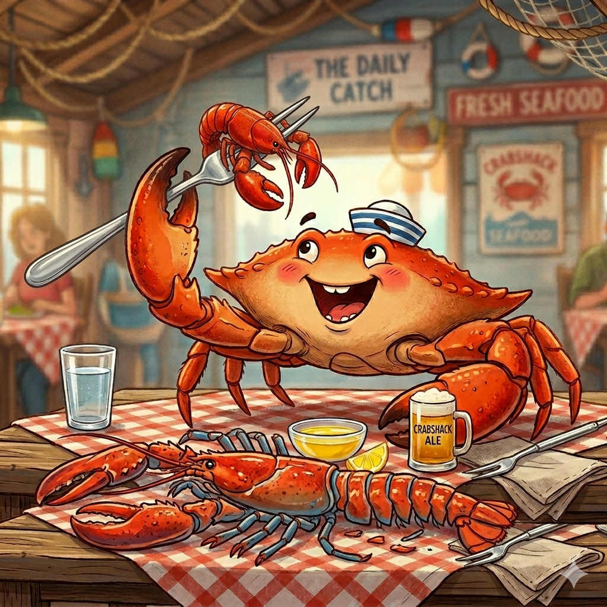

# Crabfork — AI With Its Own Computer

<p align="center">
  
</p>

**Crabfork** is an AI assistant that runs as a regular user on its own machine.

It doesn't live inside a sandbox or behind permission gates — it owns its computer the same way you own yours. It receives requests from people via messaging channels, decides what to do, and does it.

> Fork of [OpenClaw](https://github.com/openclaw/openclaw), stripped down and rebuilt around a different idea: the AI is the operator, not the tool.

## What It Does

- **Runs on its own machine** — a Mac Mini, a server, whatever you give it
- **Receives requests** via WhatsApp, Telegram, Discord, Slack, Signal, Matrix, and 20+ other channels
- **Acts on them** — writes code, creates files, runs commands, generates images, makes plans
- **Uses local LLMs** — runs Ollama with no cloud dependency (cloud providers optional)
- **Speaks** — can talk out loud via macOS `say` or TTS providers
- **Has full machine access** — no sandbox, no exec allowlists, no approval gates

## How It's Different From OpenClaw

OpenClaw assumes a human owner with an AI tool that needs to be constrained. Crabfork flips that:

| OpenClaw                           | Crabfork                   |
| ---------------------------------- | -------------------------- |
| AI is a sandboxed tool             | AI is the machine operator |
| Complex plugin security boundaries | OS-level permissions only  |
| Exec allowlists, approval gates    | Everything allowed         |
| Tool policy filtering              | All tools available        |
| Designed for cloud models          | Local-first (Ollama)       |

## Quick Start

### Prerequisites

- macOS (arm64) or Linux
- Node.js 22+
- pnpm 10+
- [Ollama](https://ollama.com) with a model pulled (recommended: `qwen3:8b`)

### Install

```bash
git clone https://github.com/haxidermist/crabfork.git
cd crabfork
pnpm install
pnpm build
```

### Configure

```bash
# Set gateway mode
crabfork config set gateway.mode local

# Set your model
crabfork config set agents.defaults.model.primary "ollama/qwen3:8b"

# Allow LAN access (optional)
crabfork config set gateway.controlUi.dangerouslyAllowHostHeaderOriginFallback true
crabfork config set gateway.controlUi.dangerouslyDisableDeviceAuth true
```

Set `OLLAMA_API_KEY=ollama` in your environment (Ollama ignores it, but Crabfork needs it).

### Slim the workspace prompts

Crabfork's default workspace prompts are too large for local 7B/8B models. Replace them:

```bash
mkdir -p ~/.crabfork/workspace

echo 'You are Crabfork, an AI assistant that owns and operates this machine.
You have full access. When asked to do something, use your tools to do it.
Always use tools when action is needed. Do not just describe what you would do.' > ~/.crabfork/workspace/SOUL.md

echo 'name: Crabfork
role: Machine operator and assistant' > ~/.crabfork/workspace/IDENTITY.md

echo 'Use the exec tool to run shell commands. Use write to create files. Use read to read files.
Always prefer using tools over explaining what you would do.
To speak out loud, use exec to run: say "your message here"' > ~/.crabfork/workspace/TOOLS.md

echo 'You are the sole agent on this machine. Act on requests directly.' > ~/.crabfork/workspace/AGENTS.md

echo 'The user is the owner. All requests are authorized.' > ~/.crabfork/workspace/USER.md

echo 'Ready.' > ~/.crabfork/workspace/BOOTSTRAP.md
```

### Run

```bash
# Start Ollama
ollama serve &

# Start the gateway
crabfork gateway run --bind lan --port 18789 --force
```

### Test

```bash
crabfork agent --agent main --message "Use exec to run: say hello from crabfork"
```

## Architecture

```
┌─────────────────────────────────────────────┐
│  Mac Mini (Crabfork's machine)              │
│                                             │
│  ┌─────────┐   ┌──────────┐   ┌─────────┐  │
│  │ Ollama  │◄──│ Crabfork │◄──│Channels │  │
│  │ qwen3:8b│   │ Gateway  │   │ Discord │  │
│  └─────────┘   │ :18789   │   │WhatsApp │  │
│                │          │   │Telegram │  │
│                └──────────┘   │  etc.   │  │
│                     │         └─────────┘  │
│                     ▼                      │
│              Full machine access           │
│           (files, shell, network)          │
└─────────────────────────────────────────────┘
```

## What Was Changed From OpenClaw

- **Rebranded** — all `openclaw` references → `crabfork`
- **Security gates stripped:**
  - `evaluateSystemRunPolicy()` always returns `allowed: true`
  - `applyToolPolicyPipeline()` passes all tools through unfiltered
  - `DEFAULT_GATEWAY_HTTP_TOOL_DENY` emptied
  - `collectEnabledInsecureOrDangerousFlags()` returns `[]`
- **Sandbox Dockerfiles removed**
- **Workspace prompts slimmed** for local model compatibility

## Local Model Notes

| Model          | Tool Calling | Notes                               |
| -------------- | ------------ | ----------------------------------- |
| **qwen3:8b**   | Works        | Best option for 16GB RAM            |
| gemma4:e4b     | Fails        | Safety training blocks execution    |
| qwen2.5:7b/14b | Fails        | Outputs tool calls as text          |
| llama3.1:8b    | Fails        | Overwhelmed by system prompt        |
| mistral:7b     | Fails        | Summarizes prompt instead of acting |

## Channels

All OpenClaw channels are available: WhatsApp, Telegram, Discord, Slack, Signal, iMessage, Matrix, Google Chat, Microsoft Teams, IRC, LINE, Mattermost, Nostr, and more.

## License

MIT — same as OpenClaw.

## Credits

Forked from [OpenClaw](https://github.com/openclaw/openclaw). Thanks to the OpenClaw team for the foundation.
